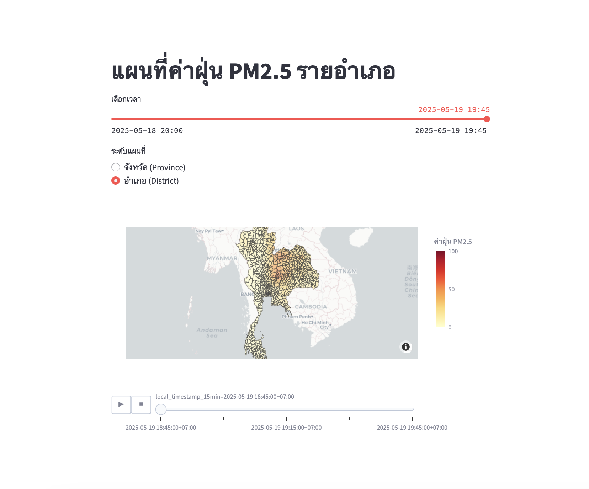
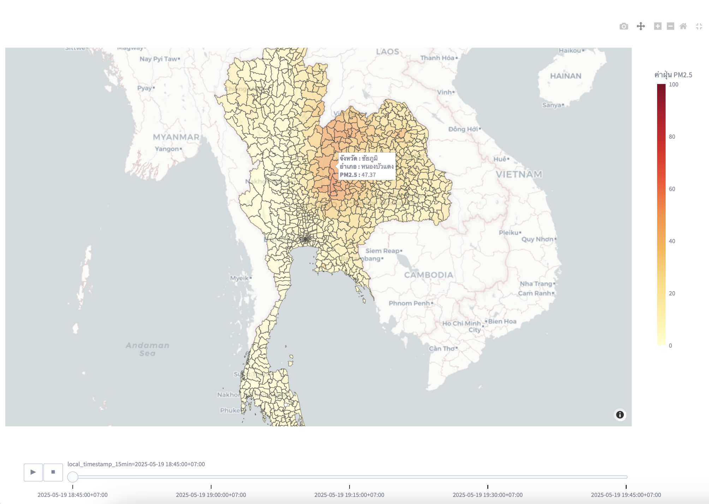

# Real-Time PM 2.5 Monitoring  Dashboard
โดย นางสาว นริศรา กรวิรัตน์ เลขทะเบียนนักศึกษา 6524651012 Project Proposal: Real-Time Weather Data Pipeline with Visualization


## 1. ความเป็นมา ##

ในยุคปัจจุบันที่ขับเคลื่อนด้วยข้อมูล ความสามารถในการรวบรวม ประมวลผล และแสดงผลข้อมูลแบบเรียลไทม์ ถือเป็นปัจจัยสำคัญที่ช่วยสนับสนุนการตัดสินใจในหลากหลายอุตสาหกรรม ตั้งแต่การเกษตรไปจนถึงการวางผังเมือง โดยเฉพาะในบริบทของคุณภาพอากาศ การมีระบบที่สามารถตรวจวัดค่าฝุ่นละอองในอากาศแบบเรียลไทม์ได้อย่างแม่นยำ จะช่วยให้ภาครัฐ ภาคเอกชน และประชาชนสามารถรับมือกับปัญหาฝุ่นละอองขนาดเล็ก (PM2.5) ได้อย่างมีประสิทธิภาพและทันท่วงที

การพัฒนา Data Pipeline ซึ่งเป็นกระบวนการที่จัดการการไหลของข้อมูลตั้งแต่การดึงข้อมูลจากแหล่งต้นทาง ไปจนถึงการจัดเก็บและการแสดงผลแบบอัตโนมัติ เป็นหัวใจสำคัญของการบริหารจัดการข้อมูลแบบเรียลไทม์ อย่างไรก็ตาม การออกแบบระบบ pipeline ดังกล่าวมักมีความซับซ้อน เนื่องจากต้องอาศัยความรู้ด้านการจัดการ workflow การใช้ containerization และเครื่องมือสำหรับการแสดงผลข้อมูล

โครงงานนี้มีเป้าหมายเพื่อขยายแนวคิดเชิงทฤษฎีไปสู่การประยุกต์ใช้งานจริง โดยมุ่งเน้นการพัฒนา pipeline ที่สามารถดึงข้อมูลค่าฝุ่น PM2.5 จาก API (เช่น OpenWeatherMap) ในทุก ๆ 15 นาที จากนั้นทำการจัดเก็บข้อมูลในฐานข้อมูลที่มีน้ำหนักเบา (lightweight) เช่น PostgreSQL และแสดงผลผ่านแดชบอร์ดแบบ interactive เพื่อให้ผู้ใช้งานสามารถติดตามสถานการณ์คุณภาพอากาศได้แบบเรียลไทม์

นอกจากนี้ โครงงานยังมุ่งสำรวจความเป็นไปได้ในการประยุกต์ใช้ Machine Learning (ML) เพื่อคาดการณ์แนวโน้มค่าฝุ่นในอนาคต ซึ่งจะช่วยยกระดับระบบจากการรายงานสถานการณ์สู่การวิเคราะห์เชิงคาดการณ์ (Predictive Analytics) ที่มีคุณค่าในเชิงการวางแผนและการตัดสินใจ

โครงการนี้มีระยะเวลาดำเนินการทั้งหมด 3 สัปดาห์ ครอบคลุมการออกแบบ พัฒนา และจัดแสดงผลระบบแดชบอร์ดสำหรับการติดตามค่าฝุ่น PM2.5 แบบเรียลไทม์ โดยใช้เครื่องมือสำคัญ ได้แก่ Prefect, Docker, PostgreSQL, และเครื่องมือสำหรับสร้างแดชบอร์ด เช่น Streamlit หรือ Looker Studio โดยมีจุดมุ่งหมายให้สามารถนำไปต่อยอดใช้งานได้จริง ทั้งในบริบทของการวิจัย การเฝ้าระวังคุณภาพอากาศในชุมชน หรือการสนับสนุนการวางแผนในระดับท้องถิ่น


## 2. วัตถุประสงค์ของโครงงาน ## 
วัตถุประสงค์หลักของโครงงาน Real-Time PM2.5 Monitoring Dashboard คือการพัฒนาระบบ pipeline ที่สามารถเก็บ ประมวลผล จัดเก็บ และแสดงผลข้อมูลค่าฝุ่นละอองขนาดเล็ก PM2.5 ได้แบบเรียลไทม์ทุก 15 นาที โดยมีเป้าหมายเพื่อแสดงกระบวนการทำงานของระบบด้านวิศวกรรมข้อมูล (Data Engineering) ที่ทันสมัย โดยมีวัตถุประสงค์เฉพาะดังนี้:

**2.1 การเก็บข้อมูล** : พัฒนา pipeline โดยใช้ Prefect 2 ในการดึงข้อมูลค่าฝุ่น PM2.5 และข้อมูลสภาพอากาศอื่นๆ (เช่น อุณหภูมิ ความชื้น ความเร็วลม) จาก OpenWeatherMap API ทุก ๆ 15 นาที สำหรับพื้นที่กรุงเทพมหานครหรือตำบลอื่นในประเทศไทย

**2.2 การประมวลผลและจัดเก็บข้อมูล** : ดำเนินการแปลงข้อมูลดิบจาก API เช่น การจัดการค่า null การแปลงหน่วย และการจัดรูปแบบข้อมูลให้อยู่ในโครงสร้างที่เหมาะสม พร้อมจัดเก็บในฐานข้อมูลที่รองรับการเข้าถึงแบบรวดเร็ว เช่น Parquet ใน data lake ที่มี schema ที่กำหนดไว้อย่างชัดเจน

**2.3 การแสดงผลข้อมูล** : สร้างแดชบอร์ดแบบอินเตอร์แอคทีฟด้วย Streamlit (หรือ Looker Studio) สำหรับแสดงค่าฝุ่น PM2.5 แบบเรียลไทม์ และแนวโน้มย้อนหลัง เพื่อให้ประชาชนทั่วไปที่ไม่มีพื้นฐานด้านเทคนิคสามารถเข้าถึงข้อมูลได้ง่าย

**2.4 การจัดการและการนำไปใช้งานจริง** : ทำการ deploy ระบบ pipeline ในสภาพแวดล้อมแบบ container โดยใช้ Docker และ Prefect  3 เพื่อให้สามารถทำงานได้อย่างเสถียร รองรับการปรับขยายในอนาคต

**2.5 การวิเคราะห์เชิงคาดการณ์** : มีการใช้ Machine Learning เบื้องต้น เช่น regression เพื่อพยากรณ์แนวโน้มค่าฝุ่น PM2.5 และหาปัจจัยที่ส่งผลให้ค่าฝุ่น PM2.5 มีปริมาณมาก โดยอิงจากข้อมูลที่เก็บมา เพื่อแสดงศักยภาพของระบบในการวิเคราะห์เชิงลึก


## 3. ประโยชน์ที่ได้รับ ##

โครงการ Real-Time Weather Data Pipeline มอบประโยชน์หลากหลายแก่ผู้มีส่วนได้ส่วนเสีย ไม่ว่าจะเป็นสถาบันการศึกษา นักเรียน นักศึกษา และองค์กรที่สนใจด้านวิศวกรรมข้อมูล โดยประโยชน์เหล่านี้สอดคล้องกับเป้าหมายทางการศึกษาของ papapipeline และสามารถนำไปใช้จริงได้ในสถานการณ์ต่าง ๆ

**3.1 ประโยชน์ด้านการศึกษา** : การเรียนรู้แบบลงมือปฏิบัติ (Hands-On Learning): เสนอกรณีศึกษาเชิงปฏิบัติในการพัฒนา data pipeline ครบทุกขั้นตอน ตั้งแต่การดึงข้อมูล ประมวลผล จัดเก็บ ควบคุมการทำงาน จนถึงการแสดงผล เหมาะอย่างยิ่งสำหรับหลักสูตรด้าน data science และ data engineering
* เครื่องมือทันสมัย (Modern Tools): เปิดโอกาสให้ผู้เรียนได้ฝึกใช้งานเครื่องมือมาตรฐานระดับอุตสาหกรรม เช่น Prefect 3, Docker และ Streamlit เตรียมความพร้อมสำหรับการทำงานสายวิศวกรรมข้อมูลในอนาคต
* การประยุกต์ใช้จริง (Real-World Application): แสดงให้เห็นว่าทฤษฎี เช่น การจัดการเวิร์กโฟลว์ (workflow orchestration) สามารถนำมาใช้แก้ปัญหาในโลกจริงได้ ช่วยเสริมสร้างความสนใจและมีส่วนร่วมของนักเรียน
* การมีส่วนร่วมในโอเพ่นซอร์ส (Open-Source Contribution): โค้ดและเอกสารของโครงการที่เผยแพร่ผ่าน GitHub สามารถแบ่งปันให้กับชุมชน นำไปต่อยอดหรือใช้ในการเรียนการสอน รวมถึงเป็นส่วนหนึ่งของทรัพยากร papapipeline

**3.2 ประโยชน์เชิงปฏิบัติ** : การติดตามแบบเรียลไทม์ (Real-Time Monitoring): ช่วยให้ผู้ใช้งานในท้องถิ่น เช่น เกษตรกร หรือผู้จัดงาน สามารถติดตามสภาพอากาศแบบใกล้เคียงเรียลไทม์ เพื่อสนับสนุนการตัดสินใจ
* ความสามารถในการขยายระบบ (Scalability): ด้วยการออกแบบแบบโมดูลาร์ (modular design) pipeline นี้สามารถขยายไปยังหลายเมือง แหล่งข้อมูลเพิ่มเติม หรือปรับใช้บนระบบคลาวด์ได้ เหมาะสำหรับแอปพลิเคชันที่ใหญ่ขึ้น
* การแสดงผลที่เข้าถึงง่าย (User-Friendly Visualization): แดชบอร์ดที่สร้างด้วย Streamlit มีอินเทอร์เฟซที่ใช้งานง่าย แม้ผู้ที่ไม่มีพื้นฐานทางเทคนิคก็สามารถเข้าถึงและเข้าใจข้อมูลแนวโน้มสภาพอากาศได้
* ศักยภาพในการพยากรณ์ (Predictive Potential): โมเดล ML เสริมที่สามารถพัฒนาเพิ่มเติมได้ ช่วยปูทางสู่การวิเคราะห์เชิงพยากรณ์ เช่น การทำนายอุณหภูมิหรือรูปแบบสภาพอากาศ ซึ่งเป็นประโยชน์ต่อภาคเกษตรกรรมหรือพลังงาน

**3.3 ประโยชน์ต่อองค์กร** : ต้นแบบต้นทุนต่ำ (Low-Cost Prototype): สร้างขึ้นโดยใช้เครื่องมือที่ให้ใช้ฟรี เช่น OpenWeatherMap API, ไฟล์ Parquet และ Streamlit ลดต้นทุนในขณะที่ยังคงให้ระบบที่ใช้งานได้จริง
* รากฐานสำหรับการต่อยอด (Foundation for Growth): ทำหน้าที่เป็นต้นแบบ (proof-of-concept) สำหรับองค์กรที่ต้องการนำระบบ real-time data pipeline ไปใช้จริง โดยสามารถพัฒนาเพิ่มเติมให้เชื่อมต่อกับระบบขนาดใหญ่ได้
* การมีส่วนร่วมของชุมชน (Community Engagement): สอดคล้องกับโครงการส่งเสริมความรู้ด้านข้อมูล (data literacy) และการพัฒนาแบบโอเพ่นซอร์ส โดยเฉพาะในบริบทด้านการศึกษาและท้องถิ่น เช่นในประเทศไทยตามแนวทางของ papapipeline


## 4. ตัวชี้วัดความสำเร็จของโครงงาน (Key Performance Indicators)
เพื่อประเมินความสำเร็จของโครงงานตลอดระยะเวลา 3 สัปดาห์ ได้กำหนดตัวชี้วัดหลัก (KPI) ใน 3 ด้าน ได้แก่ ด้านเทคนิค ด้านการศึกษา และด้านการใช้งานจริง ดังนี้

# ตัวชี้วัดของโครงการ (KPIs)

## 4.1 ตัวชี้วัดด้านเทคนิค (Technical KPIs)

### ความเสถียรของระบบดึงข้อมูล (Pipeline Reliability)
- **เป้าหมาย:** ดึงข้อมูลค่าฝุ่นจาก API สำเร็จอย่างน้อย 95% ของรอบทั้งหมดใน 24 ชั่วโมง (จากทั้งหมด 96 รอบต่อวัน)
- **วิธีวัดผล:** ตรวจสอบสถานะการทำงานของ flow ผ่าน Prefect UI ว่ามีสถานะสำเร็จ (Success) กี่รอบ

###  ปริมาณข้อมูลที่จัดเก็บ (Data Volume)
- **เป้าหมาย:** เก็บข้อมูลค่าฝุ่นและสภาพอากาศอย่างน้อย 1,000 แถวในรูปแบบไฟล์ Parquet
- **วิธีวัดผล:** ใช้คำสั่ง query เพื่อนับจำนวน record ที่จัดเก็บไว้

###  การทำงานของแดชบอร์ด (Dashboard Functionality)
- **เป้าหมาย:** แดชบอร์ดอัปเดตข้อมูลใหม่ทุก 15 นาที และสามารถโหลดหน้าได้ภายใน 3 วินาที ในอย่างน้อย 90% ของการใช้งาน
- **วิธีวัดผล:** ทดสอบความเร็วในการโหลดหน้า และดูการอัปเดตข้อมูลแบบ manual

###  ความเสถียรของระบบ Deployment (Deployment Stability)
- **เป้าหมาย:** ระบบที่รันผ่าน Docker (เช่น Jupyter, Prefect, Streamlit) ต้องเปิดทำงานต่อเนื่องได้ไม่น้อยกว่า 24 ชั่วโมง
- **วิธีวัดผล:** ตรวจสอบ log และสถานะ container ว่ารันได้ต่อเนื่องโดยไม่ล่ม

---

## 4.2 ตัวชี้วัดด้านการศึกษา (Educational KPIs)

###  คุณภาพของเอกสารและคู่มือ (Documentation Quality)
- **เป้าหมาย:** สร้าง README ใน GitHub และรายงานโครงงานที่อธิบายวิธีติดตั้ง การใช้งาน และผลลัพธ์ได้ชัดเจน โดยผู้รีวิวให้คะแนนเฉลี่ย 4/5
- **วิธีวัดผล:** ขอ feedback จากเพื่อนหรือนักศึกษาในสาขาเดียวกัน 3–5 คน

###  ผลลัพธ์การเรียนรู้ของผู้ใช้ (Learning Outcomes)
- **เป้าหมาย:** นักศึกษารุ่นน้องที่ทดลองใช้งานอย่างน้อย 80% สามารถติดตั้งและรันระบบได้เองภายในเวลา 2 ชั่วโมง
- **วิธีวัดผล:** ทดสอบกับนักศึกษากลุ่มเล็ก 5–10 คน แล้วเก็บข้อมูลเวลาและความสำเร็จ

###  การมีส่วนร่วมในชุมชนออนไลน์ (Community Engagement)
- **เป้าหมาย:** ได้รับดาว (GitHub Stars) อย่างน้อย 10 ดวง หรือมีผู้เข้าชมคลังโค้ดมากกว่า 50 ครั้ง ภายในวันที่ 31 พฤษภาคม 2568
- **วิธีวัดผล:** ตรวจสอบสถิติใน GitHub เช่น ดาว (stars), จำนวน views และ forks

---

## 4.3 ตัวชี้วัดด้านการใช้งานจริง (Practical KPIs)

###  ความสามารถในการแสดงข้อมูลที่มีประโยชน์ (Visualization Utility)
- **เป้าหมาย:** แดชบอร์ดต้องสามารถแสดงข้อมูลอย่างน้อย 3 ตัวแปร (เช่น PM2.5, อุณหภูมิ, ความชื้น) พร้อมกราฟแบบโต้ตอบได้ (interactive) อย่างน้อย 1 รายการ เช่น กราฟแสดงแนวโน้ม PM2.5
- **วิธีวัดผล:** ตรวจสอบคุณสมบัติของแดชบอร์ดจริงระหว่างการทดสอบ

###  ประสิทธิภาพของโมเดลคาดการณ์ (ML Model Performance) — ถ้ามี
- **เป้าหมาย:** โมเดล Linear Regression ควรมีค่าความแม่นยำ (R² score) ไม่น้อยกว่า 0.5 ในการพยากรณ์ค่าฝุ่น PM2.5
- **วิธีวัดผล:** คำนวณค่า R² ด้วย scikit-learn บนข้อมูลที่เก็บได้

###  ความพึงพอใจของผู้ใช้งาน (Stakeholder Satisfaction)
- **เป้าหมาย:** ได้รับคะแนนความพึงพอใจเฉลี่ยไม่ต่ำกว่า 4 จาก 5 คะแนน จากผู้มีส่วนเกี่ยวข้อง 3–5 คน เช่น อาจารย์หรือผู้สนใจด้านสิ่งแวดล้อม
- **วิธีวัดผล:** แจกแบบสอบถามหรือสัมภาษณ์หลังนำเสนอระบบ


## 5. ภาพรวมแผนดำเนินโครงการ ##
**ระยะเวลา: 3 สัปดาห์ (ประมาณ 10–15 ชั่วโมงต่อสัปดาห์) แผนงานรายสัปดาห์ (Timeline)**

* สัปดาห์ที่ 1 (28 เมษายน – 4 พฤษภาคม):
 ออกแบบโครงสร้างระบบและฐานข้อมูล ออกแบบ Data Architecture และ Data Flow Diagram สร้าง repository บน GitHub สำหรับจัดการเวอร์ชันของโค้ด ติดตั้งและตั้งค่า Docker environment ออกแบบ schema สำหรับจัดเก็บข้อมูลในรูปแบบ Parquet ผลลัพธ์ที่ส่งมอบ (Deliverables): ผังโครงสร้างระบบ (Infrastructure Diagram) แผนผังฐานข้อมูล (Parquet Schema) ไฟล์ docker-compose.yml พร้อมใช้งาน

* สัปดาห์ที่ 2 (5 – 11 พฤษภาคม):
 พัฒนา Pipeline และ Dashboard เพื่อแสดงผล, พัฒนา Prefect Flow สำหรับดึงข้อมูล PM2.5 และสภาพอากาศจาก OpenWeatherMap ผ่าน API ทุก 15 นาที ประมวลผลและจัดเก็บข้อมูลลงใน Parquet, พัฒนา Dashboard ด้วย Streamlit สำหรับแสดงข้อมูล PM2.5 แบบเรียลไทม์, เพิ่มฟีเจอร์เลือกระดับใน Dashboard เช่น ระดับจังหวัดและระดับอำเภอ, พัฒนา Map ใน Dashboard เพื่อให้ง่ายต่อการนำไปใช้งานต่อ  ผลลัพธ์ที่ส่งมอบ: Flow ที่ทำงานได้สมบูรณ์ใน Prefect ข้อมูลที่เก็บในไฟล์ Parquet Dashboard ที่แสดงข้อมูลและอัปเดตตามเวลาจริง อัปเดตโค้ดบน GitHub อย่างต่อเนื่อง

* สัปดาห์ที่ 3 (12 – 18 พฤษภาคม):
 ทดสอบระบบและจัดทำเอกสารรายงาน ทำการ deploy ระบบให้ทำงานต่อเนื่อง 24 ชั่วโมงขึ้นไป ตรวจสอบความเสถียรและประสิทธิภาพของ Dashboard เพิ่มฟีเจอร์เชิงโต้ตอบใน Dashboard (เช่น กราฟย้อนหลัง, ฟิลเตอร์ข้อมูล) จัดทำรายงานและ README พร้อมคำอธิบายการใช้งาน ผลลัพธ์ที่ส่งมอบ: ระบบ pipeline ที่ deploy แล้ว และทำงานได้จริง Dashboard ที่ผ่านการทดสอบ ไฟล์ README บน GitHub เครื่องมือและทรัพยากรที่ใช้ (Resources & Tools) Prefect 2 – สำหรับจัดการ workflow และ scheduling Docker – สำหรับจัดสภาพแวดล้อมแบบ container OpenWeatherMap API – แหล่งข้อมูล PM2.5 และสภาพอากาศ (free tier) Python – ภาษาหลักในการพัฒนา Streamlit – สำหรับสร้าง Dashboard แบบโต้ตอบได้ Parquet / PostgreSQL – สำหรับจัดเก็บข้อมูลแบบมีโครงสร้าง (แนะนำให้เพิ่ม PostgreSQL หากต้องการให้มีระบบ query เชิงลึก) GitHub – สำหรับ version control และเผยแพร่โครงการ

## 6. บทสรุป ##
โครงงาน Real-Time PM2.5 Monitoring Dashboard เป็นโอกาสสำคัญในการผสานเป้าหมายทางการศึกษากับการใช้งานจริง โดยต่อยอดจากกรอบแนวคิดของโครงการ papapipeline ที่ใช้ Prefect, Docker และ GitHub ในการสอนแนวคิดด้าน Data Pipeline ให้แก่ผู้เริ่มต้นในสายงานวิศวกรรมข้อมูล โครงงานนี้มุ่งเน้นการพัฒนา pipeline ที่สามารถดึงข้อมูลค่าฝุ่น PM2.5 และสภาพอากาศจาก OpenWeatherMap API ทุก 15 นาที นำข้อมูลไปจัดเก็บและแสดงผลแบบโต้ตอบได้ผ่านแดชบอร์ดที่ใช้งานง่าย พร้อมทั้งทดลองเสริมศักยภาพของระบบด้วยการใช้ Machine Learning เพื่อคาดการณ์แนวโน้มค่าฝุ่นในอนาคตและหาปัจจัยที่ส่งผลให้ค่าฝุ่น PM2.5 มีค่ามาก จุดเด่นของโครงงานนี้คือ: โครงสร้างที่สามารถขยายขนาดได้ (scalable) ต้นทุนต่ำโดยใช้เครื่องมือ open-source มีเป้าหมายชัดเจนทางด้านเทคนิค การเรียนรู้ และประโยชน์เชิงปฏิบัติ ออกแบบมาให้เข้าใจง่ายและเข้าถึงได้ แม้สำหรับผู้ใช้งานที่ไม่มีพื้นฐานด้านเทคนิค การกำหนด ตัวชี้วัดความสำเร็จ (KPIs) อย่างรอบด้านช่วยให้สามารถประเมินผลการดำเนินงานได้อย่างชัดเจน ทั้งในแง่ของความเสถียรทางเทคนิค ผลกระทบต่อการเรียนรู้

##  เทคโนโลยีที่ใช้

1. **Jupyter Notebook**: สำหรับการวิเคราะห์และแสดงผลข้อมูล  
2. **Docker Compose**: สำหรับการจัดการและรันคอนเทนเนอร์ของแอปพลิเคชัน  
3. **Shell Script**: สำหรับการตั้งค่าและรันระบบอัตโนมัติ

---

##  Start the project

1. **Install Docker on your device.** 
   หากยังไม่มี สามารถดูวิธีติดตั้งได้จาก [Docker Docs](https://docs.docker.com/get-docker/)

2. **Clone this Repository:**
   ```bash
   git clone https://github.com/narisaraa/dsi321_2025.git

3. **then go into folder dsi321_2025 where docker-compose.yml exist.**
   ```bash
   cd dsi321_2025


    ├── dsi321_2025
    │   ├── docker-compose.yml


4. **Run Docker:**
   ```bash
   docker compose up --build -d

5. **ติดตั้ง dependencies (หากไม่ใช้ Docker):**
   ```bash
   pip install -r requirements.txt

6. **Create file .env:**
   ```bash
   OPENWEATHER_API_KEY=YOUR_API_KEY

    LAKEFS_ACCESS_KEY=access_key
    LAKEFS_SECRET_KEY=secret_key
    LAKEFS_ENDPOINT=http://lakefs-dev:8000/

7. **Create repositories on LakeFS (port:8000):**
   ```bash
   streamlit run app.py

8. **Deploy flow on jupyter terminal (port:8888):**
   ```bash
   python deploy.py

9. **Check flow on Prefect-server (port:4200):**
On Deployment menu should show main-flow schedule.
wait untill flow finish for first time then check you data on LakeFS.

10.**Open Streamlit to see dashboard (port:8501):**

## แผนที่ระดับจังหวัด


## แผนที่ระดับอำเภอ

